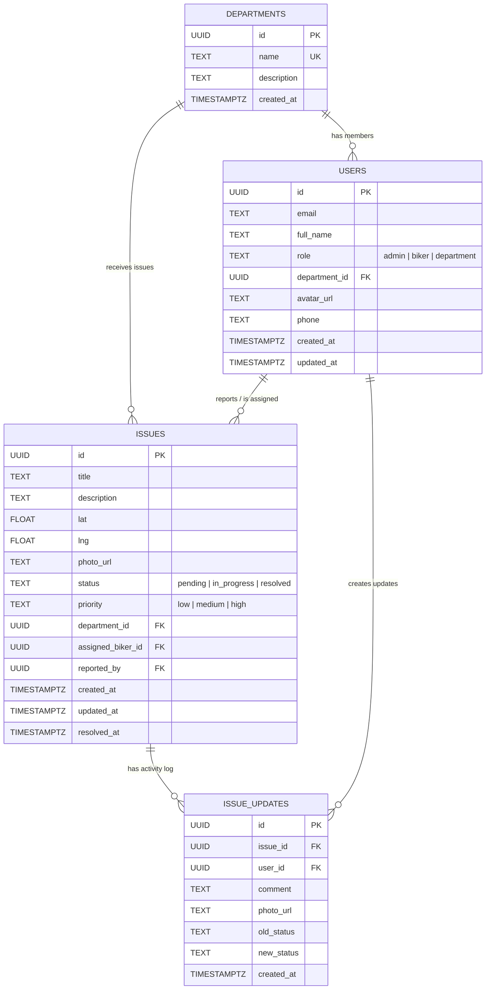
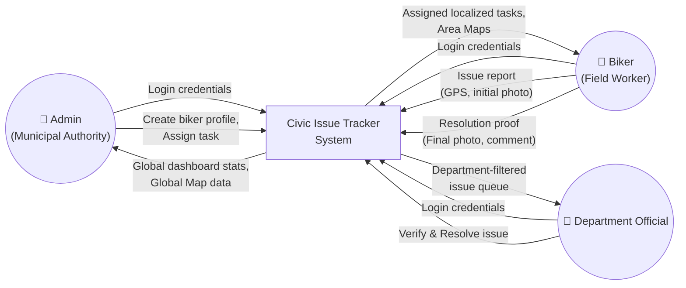
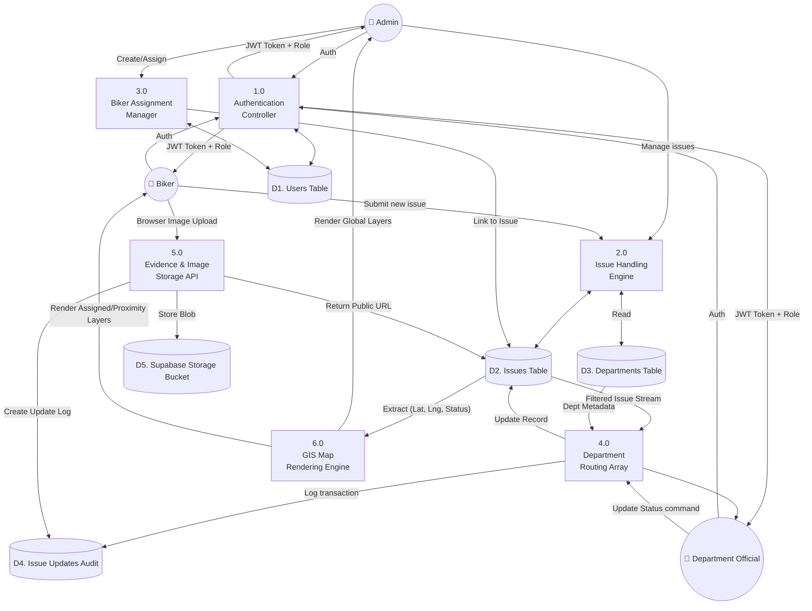

# Civic Issue Tracker - Diagrams

## 1. Use Case Diagram

```mermaid
usecaseDiagram
    actor Admin
    actor Biker
    actor DepartmentOfficial

    rectangle "Civic Issue Tracker System" {
        usecase "Login & Authenticate" as UC1
        usecase "View Global Statistics & Map" as UC2
        usecase "Manage All Issues" as UC3
        usecase "Manage Bikers/Workers" as UC4
        
        usecase "Report New Issue (GPS + Photo)" as UC5
        usecase "View Assigned Tasks Map" as UC6
        usecase "Upload Resolution Proof" as UC7
        
        usecase "View Department-Specific Issues" as UC8
        usecase "Verify Proof & Mark Resolved" as UC9
    }

    Admin --> UC1
    Admin --> UC2
    Admin --> UC3
    Admin --> UC4

    Biker --> UC1
    Biker --> UC5
    Biker --> UC6
    Biker --> UC7

    DepartmentOfficial --> UC1
    DepartmentOfficial --> UC8
    DepartmentOfficial --> UC9
```

## 2. Entity-Relationship (ER) Diagram



## 3. Data Flow Diagram (Level 0 - Context)



## 4. Data Flow Diagram (Level 1)


